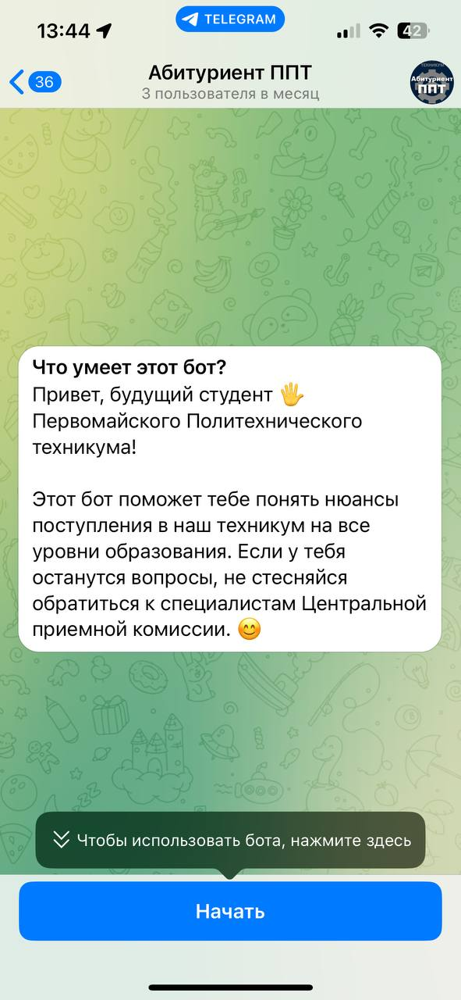
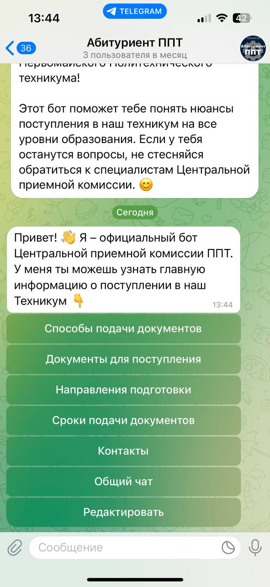

<h3 align="center">Этот проект был создан в рамках научно-исследовательской работы "Шаг в науку 2024 года"  </h3>


Проект представляет собой <b>Телеграм бота</b>, разработанного на языке Dart, который предназначен для <b>помощи абитуриентам в процессе поступления в техникум</b>. 

<p align="center">



Бот предоставляет информацию о специальностях, сроках подачи документов, а также отвечает на часто задаваемые вопросы.


<h3 align="center">Цели проекта</h3>

• Помощь абитуриентам в получении актуальной информации о поступлении.

• Изучение и проработка языка Dart через практическую разработку.

## 😄 Связь

Для связи и получения дополнительной информации вы можете написать мне в Телеграм: [Связаться](https://t.me/+cf2q3VWVKDM3NzYy)

## 🦉Установка и запуск

1. Клонируйте репозиторий:
   
   ```git clone https://github.com/DenUP/telegram```
   

2. Перейдите в директорию проекта:
   
   ```cd telegram```
   

3. Установите зависимости:
   
   ```dart pub get```
   

4. Запустите бота:
   
   ```dart run```
   

## ✏️ Используемые технологии

• Язык программирования: <p align="left">  </a> <a href="https://dart.dev" target="_blank" rel="noreferrer">  </a> </p>

• Платформа: Telegram API

## 💡 Вклад

Если вы хотите внести свой вклад в проект, пожалуйста, создайте форк репозитория и отправьте пулл-реквест с вашими изменениями.

---

Спасибо за интерес к моему проекту! Надеюсь, что  бот поможет многим абитуриентам сделать правильный выбор и успешно поступить в техникум!v